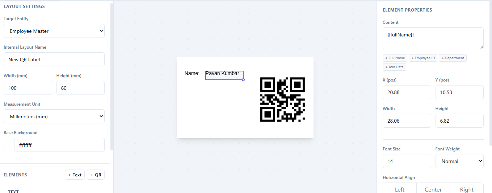

# qrlayout-ui

**An embeddable, framework-agnostic drag-and-drop QR label designer for React, Angular, Vue, Svelte, and plain HTML.**

[](https://www.npmjs.com/package/qrlayout-ui)
[](../../LICENSE)
[](https://www.typescriptlang.org/)

Drop a professional label designer into your app in minutes. Supports drag-and-drop element placement, live preview, dark mode, data binding with `{{variables}}`, and layout export to JSON.



---

## Features

- **Framework Independent** — Built with vanilla TypeScript; mount inside React, Vue, Angular, Svelte, or a plain HTML page.
- **Drag & Drop Designer** — Visual placement and resizing of text, QR, and barcode elements on a canvas.
- **Multi-Select** — Ctrl+Click or Ctrl+A to select multiple elements; drag them all together.
- **Alignment Tools** — Align selected elements relative to each other or snap them to the label edges.
- **Always-visible borders** — Element outlines stay visible while you're editing, so you can see field boundaries at all times.
- **Live Preview** — Preview your label with real sample data as you design.
- **Preview PDF / Preview ZPL** — Built-in buttons to preview the label as a PDF or as a Labelary-rendered ZPL image with DPI selector (203 / 300 / 600).
- **Data Binding** — Bind any field like `{{name}}`, `{{id}}`, or `{{department}}` from your entity schema.
- **Multi-Variable QR** — Set a separator (e.g. `|`) on QR elements to automatically join multiple fields into one scan.
- **Rich Text Styling** — Font size, weight, and alignment in the designer; color, font family, word-wrap, and line height via JSON.
- **Undo / Redo** — 20-step history with Ctrl+Z / Ctrl+Y.
- **Keyboard Shortcuts** — Delete, Arrow nudge, Shift+Arrow ×5, Ctrl+D duplicate, Ctrl+A select all, Escape.
- **Label Size Presets** — Common shipping, badge, and tag sizes built in.
- **Snap-to-Grid** — Optional 1-unit grid snapping for drag and resize.
- **Dark Mode** — Built-in light and dark themes.
- **Flexible Units** — Design in mm, cm, in, or px.
- **JSON Output** — Save the layout as a compact JSON object to your backend or `localStorage`.

---

## Installation

```bash
npm install qrlayout-ui qrlayout-core
```

---

## Getting Started

Import the CSS in your project's entry point:

```javascript
import "qrlayout-ui/style.css";
```

Mount the designer:

```typescript
import { QRLayoutDesigner } from "qrlayout-ui";

const designer = new QRLayoutDesigner({
  element: document.getElementById("designer-container"),

  entitySchemas: {
    employee: {
      label: "Employee",
      fields: [
        { name: "name",       label: "Full Name"    },
        { name: "id",         label: "Employee ID"  },
        { name: "department", label: "Department"   },
      ],
      sampleData: {
        name: "Alice Johnson",
        id: "EMP-001",
        department: "Engineering"
      }
    }
  },

  initialLayout: savedLayout, // optional — pre-load an existing layout

  onSave: (layout) => {
    localStorage.setItem("my-layout", JSON.stringify(layout));
  }
});
```

The designer fills 100% of its parent element — give the container a fixed size:

```css
#designer-container {
  width: 100%;
  height: 100vh;
}
```

Clean up when done:

```javascript
designer.destroy();
```

---

## Options

| Option | Type | Required | Description |
|---|---|---|---|
| `element` | `HTMLElement` | ✅ | The DOM element to mount the designer into |
| `entitySchemas` | `Record<string, Schema>` | ❌ | Entity field definitions for `{{field}}` binding and live preview |
| `initialLayout` | `StickerLayout` | ❌ | Layout to pre-load on mount |
| `onSave` | `(layout: StickerLayout) => void` | ❌ | Callback when "Save Layout" is clicked |

---

## Layout Persistence & Printing

The `onSave` callback gives you the complete layout as a plain JSON object. Store it anywhere, load it back anytime, and pass it with real data to `qrlayout-core` for printing.

### Save the layout

```typescript
const designer = new QRLayoutDesigner({
  element: document.getElementById("designer"),
  onSave: async (layout) => {
    await fetch("/api/layouts", {
      method: "POST",
      headers: { "Content-Type": "application/json" },
      body: JSON.stringify(layout)
    });
  }
});
```

### Load a saved layout

```typescript
const saved = await fetch("/api/layouts/employee-badge").then(r => r.json());

const designer = new QRLayoutDesigner({
  element: document.getElementById("designer"),
  initialLayout: saved,
  onSave: (layout) => { /* update in DB */ }
});
```

### Print with real data

```typescript
import { StickerPrinter } from "qrlayout-core";
import { exportToPDF } from "qrlayout-core/pdf"; // requires: npm install jspdf

const printer = new StickerPrinter();
const layout  = await fetch("/api/layouts/employee-badge").then(r => r.json());
const records = await fetch("/api/employees").then(r => r.json());

// PNG — one file per record
for (const record of records) {
  const blob = await printer.exportToPNG(layout, record);
  const url  = URL.createObjectURL(blob);
  const a    = Object.assign(document.createElement("a"), { href: url, download: `${record.id}.png` });
  a.click();
  URL.revokeObjectURL(url);
}

// PDF — all records in one file
const pdf = await printer.exportToPDF(layout, records);
pdf.save("batch-badges.pdf");

// ZPL — for Zebra / thermal printers (sync, 203 DPI)
const zplPages = printer.exportToZPL(layout, records, { dpi: 203 });

// ZPL — async variant for 300/600 DPI; ensures QR codes print at the correct size
const zplPages = await printer.exportToZPLAsync(layout, records, { dpi: 300 });
```

---

## Integration Examples

### React (TypeScript)

```tsx
import { useEffect, useRef } from 'react';
import { QRLayoutDesigner } from 'qrlayout-ui';
import 'qrlayout-ui/style.css';

const LabelDesigner = () => {
  const containerRef = useRef<HTMLDivElement>(null);

  useEffect(() => {
    if (!containerRef.current) return;
    const designer = new QRLayoutDesigner({
      element: containerRef.current,
      onSave: (layout) => console.log('Saved:', layout)
    });
    return () => designer.destroy();
  }, []);

  return <div ref={containerRef} style={{ width: '100%', height: '100vh' }} />;
};
```

### Vue 3 (Composition API)

```vue
<script setup>
import { onMounted, onUnmounted, ref } from 'vue';
import { QRLayoutDesigner } from 'qrlayout-ui';
import 'qrlayout-ui/style.css';

const container = ref(null);
let designer = null;

onMounted(() => {
  designer = new QRLayoutDesigner({
    element: container.value,
    onSave: (layout) => console.log('Saved:', layout)
  });
});
onUnmounted(() => designer?.destroy());
</script>

<template>
  <div ref="container" style="width: 100%; height: 100vh;" />
</template>
```

### Angular (v17+ Standalone)

```typescript
import { Component, ElementRef, ViewChild, OnInit, OnDestroy } from '@angular/core';
import { QRLayoutDesigner } from 'qrlayout-ui';
import 'qrlayout-ui/style.css';

@Component({
  standalone: true,
  selector: 'app-label-designer',
  template: '<div #container style="width: 100%; height: 100vh;"></div>'
})
export class LabelDesignerComponent implements OnInit, OnDestroy {
  @ViewChild('container', { static: true }) container!: ElementRef;
  private designer?: QRLayoutDesigner;

  ngOnInit() {
    this.designer = new QRLayoutDesigner({
      element: this.container.nativeElement,
      onSave: (layout) => console.log('Saved:', layout)
    });
  }
  ngOnDestroy() { this.designer?.destroy(); }
}
```

### Svelte 5 (Runes)

```svelte
<script lang="ts">
  import { onMount } from 'svelte';
  import { QRLayoutDesigner } from 'qrlayout-ui';
  import 'qrlayout-ui/style.css';

  let container = $state<HTMLDivElement | null>(null);

  onMount(() => {
    if (!container) return;
    const designer = new QRLayoutDesigner({
      element: container,
      onSave: (layout) => console.log('Saved:', layout)
    });
    return () => designer.destroy();
  });
</script>

<div bind:this={container} style="width: 100%; height: 100vh;" />
```

### Vanilla JavaScript / HTML

```html
<!DOCTYPE html>
<html>
<head>
  <link rel="stylesheet" href="node_modules/qrlayout-ui/dist/style.css">
  <style>#designer { width: 100%; height: 100vh; }</style>
</head>
<body>
  <div id="designer"></div>
  <script type="module">
    import { QRLayoutDesigner } from 'qrlayout-ui';
    const designer = new QRLayoutDesigner({
      element: document.getElementById('designer'),
      onSave: (layout) => localStorage.setItem('layout', JSON.stringify(layout))
    });
  </script>
</body>
</html>
```

---

## Related

- **[`qrlayout-core`](../core/README.md)** — Use the same layout JSON to render PNG, PDF, or ZPL without the UI

---

## License

MIT © Mithun Dev

